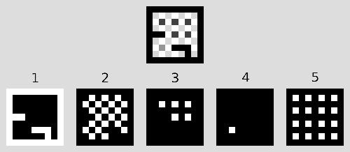
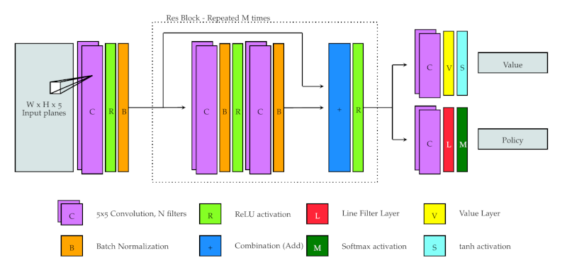

# AlphaDots

This diectory contains python code for the models used in the AlphaDots AIs. 
There are several models in the modelServer/model directory. The models are 
based on Keras and Tensorflow. 

Besides the models there is a dataset converter which receives data from KSquares
and saves the data as a numpy array. The modelServer is used to provide inference
("play the game") for KSquares.

There also is documentation for the script that creates new AlphaZero models
from scratch.

Please have a look at `ksquares/src/alphaDots/README.md` for [documentation of the 
datasets](KSquares.html)
 used to train these models.
 
## Requirements

Please install the following packages:

```
sudo pip install tensorflow-gpu pyyaml keras matplotlib zmq protobuf numpy
```

## Models

### [First try](FirstTry.html)

This model is a 7 layer convolutional neural network. Each layer consists of 64 
filters with 3 x 3 kernels. Filters are also called "feature maps". The first six 
layers use the ReLU activation function while the last layers uses softmax.

[first try model architecture](firstTry_architecture.png)
 
The model was trained with stochastic gradient descend using a categorical crossentropy 
loss function. Training occured on 10000 examples for 50 epochs.

The input for the model is a greyscale image of the game's state. The image data
is normalized such that black corresponds to 0 and white to 1.


### Stage one

Same model as *first try*. The model was trained on more training data. This was
mostly about sending and receiving data more efficiently (using protobuf and
zeroMQ instead of using actual .png image files for each training example)

### [Basic Strategy](BasicStrategy.html)

Same model as *first try*. The model was trained on different training data than
*first try* and *stage one*. The new data differs in the target images: instead of
showing just one expected move, the target images may contain all equally good moves.
This is useful in the first phase of the game, where the rule based opponents in
KSquares randomly select one of many equally good lines. 

### [LSTM](LSTM.html)

This model is built with the Keras layer ConvLSTM2D and is based on the Keras
example [conv_lstm.py](https://github.com/keras-team/keras/blob/master/examples/conv_lstm.py)

### [AlphaZero V1](AlphaZeroV1.html)

Have a look at the [AlphaZeroV1 model architecture](AlphaZeroV1_architecture.png).

This model is based on the model described in the AlphaZero paper. The model's code is
 based on [Chess Alpha Zero](https://github.com/Zeta36/chess-alpha-zero). In contrast to 
Chess Alpha Zero, this model does not have a Dense Layer for the policy output. 
Also it does not yet have a value output.

The architecture is modified to be fully convolutional to allow for arbitraryly sized board
inputs. Thus there are no final dense layers.

This model uses a custom made Keras layer called `LineFilterLayer` for the policy output. The
`LineFilterLayer` uses Tensorflow's `boolean_mask` method to filter out all elements but 
the lines in the output image. As a result, the policy output is a vector of all lines 
in the Dots and Boxes game. The training data is converted accordingly.

When the AlphaZero model is instantiated, the `LineFilterLayer` needs to know the board size.
While the rest of the model is fully flexible since it solely relies on convolutional layers,
the `LineFilterLayer` must be adapted to different board sizes, because each board size
requires a specific boolean filter mask. Although this is rather inconvenient, it does not
restrict the model's general abilities. The `LineFilterLayer` has no trainable parameters. 

The input images in the StageOne dataset are converted to the format described in the
AlphaZero paper: The input image represents each element with a different shade (value
from 0 to 255), while the AlphaZero paper uses a multi plane input where each plane
represents one element in a boolean encoding. For Dots and Boxes images
there are five elements:

1. Background
2. Lines
3. Dots
4. Boxes captured by the first player
5. Boxes captured by the second player



For each element there is a plane which is 1.0 on all positions where the corresponding
element is present in the original input image and 0.0 otherwise.

The target images in the StageOne dataset always show exactly one line, which is the
action of the Hard AI in KSquares. The target images are converted to a vector where each
entry represents one line. The vector's length corresponds to the number of lines in the
image.

Training was done on a small 5x4 StageOne dataset.


### [AlphaZero V2](AlphaZeroV2.html)

This model is just like V1 and simply received more training on a 6x6 StageOne dataset
consisting of 1,000,000 examples.

### [AlphaZero V3](AlphaZeroV3.html)

This model takes the trained model from AlphaZero V2 and trains it further on a 5x4
StageOne dataset with 1,000,000 examples.

### [Basic Strategy 2](BasicStrategyTwo.html)

This model is like the first Basic Strategy model, but with the new `LineFilterLayer` and multi plane input data.

### [LSTM2](LSTM2.html)

This model is like the first LSTM model, but this one uses the `LineFilterLayer` and
multi plane input data.

### [AlphaZero V4](AlphaZeroV4.html)

Nothing changed concerning the model's architecture. Instead, the model was trained from
scratch on a new StageOne dataset where 90% of the games were made solely with hard ai
moves and 10% of the games included random moves. Previous StageOne datasets had 90%
random moves.

### [AlphaZero V5](AlphaZeroV5.html)

This model was trained on 10 different StageTwo datasets, consisting of 1,000,000
examples each.

### [AlphaZero V6](AlphaZeroV6.html)

Have a look at the [AlphaZeroV6 model architecture](AlphaZeroV6_architecture.png).

First model with a second output that estimates the probability to win the game from the
current player's perspective. The model was trained on a 5x4 StageThree dataset with 1,000,000 examples. 

In this version, the value head of the network is built with a fixed Dense layer as a
first proof of concept. The input of the value head is attached to the output of the 
"tower", which is made of four residual blocks. First, a convolutional layer reduces
the number of planes to a single plane. Then, the flattened output is connected to a
special dense layer, where the weights are constant: they are not trained and are all 
set to `1 / (image width * image height)`. Finally, a `tanh` activation is applied so
that the value output is in the range from -1 to 1.

The following excerpt shows the creation of the value head:

```
x = Conv2D(1, kernelSize, padding='same', kernel_regularizer=l2(l2reg), name="value_conv")(res_out)
x = Flatten()(x)
x = Dense(1, trainable=False, kernel_initializer=Constant(1.0/(imgWidth*imgHeight)), use_bias=False, name="value_dense")(x)
x = Activation("tanh", name="value_tanh")(x)
value_output = x
```

This model setup enforces a board size, because Keras' Flatten and Dense layer require
a known input size. Due to this limitation, AlphaZeroV6 is not included in the evaluation
process.


### [AlphaZero V7](AlphaZeroV7.html)

Have a look at the raw version of [AlphaZeroV7 model architecture](AlphaZeroV7_architecture.png) or
see the following image for a general depiction of the network's architecture:



This is the first model to use the custom `ValueLayer`, which acts like the previously
described setup of the `Flatten` and `Dense` layers, but supports arbitrary input sizes
 like the `LineFilterLayer`.

Additionally this model has 8 residual blocks instead of 4. It also has 128 filters 
in each convolutional layer instead of 64. As a result, it takes about twice as long
to train one epoch.

|Model|Games|Wins vs. Easy in 1000 games|Wins vs. Medium in 1000 games|Wins vs. Hard in 1000 games|Errors|
|---|---|---|---|---|---|
|AlphaZeroV7|3000|951|860|501|0|

### [AlphaZero V8](AlphaZeroV8.html)

This version is based on AlphaZeroV7 and simply received 8 more epochs of training on
2.000.000 StageThree samples with a board size of 4x3. Direct model evaluation resulted
in significantly worse performance when playing against the Hard AI of KSquares:

|Model|Games|Wins vs. Easy in 1000 games|Wins vs. Medium in 1000 games|Wins vs. Hard in 1000 games|Errors|
|---|---|---|---|---|---|
|AlphaZeroV8|3000|913|411|229|0|

### [AlphaZero V9](AlphaZeroV9.html)

This version is based on AlphaZeroV7 and trained on a small StageFour dataset with 
data augmentation. Since it takes a very long time to generate StageFour data, the
generated data is augmented by flipping input and policy images vertically, horizontally or both.
There are four augmented variants for each sample:

* Flipped horizontally
* Flipped vertically
* Flipped horizontally, then flipped vertically
* Flipped veritcally, then flipped horizontally

As a result the number of distinct samples to train on is `5 * #StageFourSamples`.
The implementation is based on [keras.utils.Sequence](https://keras.io/utils/#sequence).

### [AlphaZero V10](AlphaZeroV10.html)

AlphaZeroV10 is not a python notebook but a python script, that is used by KSquares's
Self-Play mode to train neural networks on newly generated data. This script is
designed to be a little more versatile than the usual IPython notebook. It was used
to improve other AlphaZero versions, like for example AlphaZero V11.

### [AlphaZero V11](AlphaZeroV11.html)

The linked notebook only constitutes the very first part of AlphaZero V11 because it
creates a base version of the model, which was then improved by 
[KSquares's self-play mode](KSquares.html#self-play) with the StageFourNoMCTS dataset 
generator. V11 received training in 38 iterations
on various board sizes. Each iteration had 10,000 samples which were augmented like in 
AlphaZero V9. Training happened for 3 epochs per iteration.

### AlphaZeroV12

This AlphaZero model was trained for 35 iterations with 500,000 examples per iteration that 
were created with the StageFour (NoMCTS) dataset generator. The dataset generator was
configured with the following parameters:

* --hp-sigma-scale 0.2 
* --hp-mean-scale 0.6 
* --board-sizes 4x4,5x4,6x4,6x5,6x6,7x5,7x6,8x6,10x6,12x6,14x6,8x8,10x10,12x12,14x14 

For each iteration one board size was selected randomly from the configured list.

Training ran for eight days in a Docker container on a computer in the MEVIS lab, kindly 
provided by Hans Meine - thank you for your support!

### AlphaZeroV13 / AlphaZeroV13_SP

This model was used in a first evaluation of the self-play reinforcement learning.
First, AlphaZeroV13 was trained with supervised learning exclusively on 3x3 boards. 
Afterwards, it was trained with the self-play mode in KSquares to create. The results were 
very bad - the V13_SP model lost all games after training.


To find out what went wrong, AlphaZero MCTS was run with V13 on the 13 
[Berlekamp Tests](Tests.html) to debug the MCTS algorithm. This lengthy process is
documented partly in a [Jupyter notebook](DebugAlphaZeroMCTS.html).
After fixing bugs, most of Berlekamp's tests are passed by AlphaZero MCTS with the V13 model.

### AlphaZeroV14 / AlphaZeroV14_SP

After fixing a lot of bugs in the AlphaZero MCTS algorithm, this model was first trained
with supervised learning on 2 million 3x3 boards (V14) and then trained for 50 iterations
with 128 examples each in self-play (V14_SP). 

Model|Games|Wins vs. Easy in 10 games|Wins vs. Medium in 10 games|Wins vs. Hard in 10 games|Errors
---|---|---|---|---|---
AlphaZeroV14_MCTS|300|93|84|60|0
[AlphaZeroV14_SP_MCTS](ModelEvaluationReport-V14_SP.html)|300|98|87|39|0|

At least it does not degrade as fast as V13. Nevertheless the results of
self-play training are subpar.

## Create AlphaZero models

To add a new model to AlphaDots, you have to create a neural network and list it in the
`modelServer/models/models.yaml` file that stores all available models. The easiest way
to do this is to use the `createModel.py` script that creates AlphaZero models and adds
them to the model list. If that does not fit your needs, here is an explanation of
the entries in `models.yaml` so that you can add your own models:

```
  - name: AlphaZeroV7
    desc: Seventh AlphaZero model
    path: alphaZero/model/alphaZeroV7.h5
    type: PolicyValue
    ai: ConvNet
```

* The `name` and `desc` are used to name and describe the model. The name will show up
  in the modlel list in KSquares.
* The `path` is the path to the model file, that is loaded with the Keras `load_model`
  method. The path is relative to the directory where `models.yaml` resides.
* Depending on the listed `type` of the entry an according model handler will be used.
  You may add your own model handler to the model server. These are the supported
  types of models:
    * `DirectInference` This model handler expects the model to take an input image
      and provide an output image of the same size with two layers. The input image 
      from KSquares is only normalized so that the pixels are in the range from 0 to 1.
      The first layer of the output image is sent to KSquares to select the line with
      maximum value. Input shape: (batch size, image height, image width, 1)
      Output shape: (batch size, image height, image width, 2)
    * `DirectInferenceCategorical` The model handler expects the model to take a five
      layered input image and provide an ouput image of the same size with two layers. 
      The input from KSquares is transformed so that each element of the game is on one plane.
      The output of the model must be made of two layers. The first layer is sent to
      KSquares which selects the line with maximum value. 
       * Input shape: (batch size, image height, image width, 5)
       * Output shape: (batch size, image height, image width, 2)
    * `Sequence` This model handler provides the model with a sequence of normalized input 
      images that range from the beginning of the game to the current state of the board.
      The output has to be a two layer image. The first layer is sent back to KSquares.
       * Input shape: (batch size, sequence length, image height, image width, 1)
       * Output shape: (batch size, image height, image width, 2)
    * `SequenceCategorical` This model handler transforms the sequence so that each element
      is on one layer. The output has to be a two layer image of which the first is sent to
      KSquares.
       * Input shape: (batch size, sequence length, image height, image width, 5)
       * Output shape: (batch size, image height, image width, 2)
    * `PolicyValue` This model handler is used for the AlphaZero models. It provides an
      input image in five layers where each layer represents one element of Dots and Boxes.
      There have to be two outputs: policy and value. The policy output is a vector with
      an entry for each line. The value output is a single real number.
       * Input shape: (batch size, image height, image width, 5)
       * Policy output shape: (batch size, number of lines)
       * Value output shape: (batch size, 1)
* The `ai` entry can be one of the following values:
  * `ConvNet` This corresponds to KSquares ConvNet AI that provides an interface to play
    directly against the neural network.
  * `MCTS-AlphaZero` This is used for the Alpha Zero Monte-Carlo Tree Search algorithm in
    KSquares.

### Script to create new AlphaZero models

The `createModel.py` script creates new AlphaZero models according to the provided
parameters and adds the new model to the list of available models in AlphaDots. It 
supports the following configuration options:

* `--name STR` The name for the new model. It must be a unique name that no existing model
  uses.
* `--desc STR` The description for the new model
* `--resblocks NUM` The number of residual blocks in the neural network
* `--filters NUM` The number of kernels that each convolutional layer has
* `--kernelsize NUM` The size of a kernel in each convolutional layer. You must provide
  only one value. Use `--kernelsize 3` to specify a `3x3` kernel.
* `--withmctsai` Set this flag and the script will create extra entries in the `models.yaml`
  file where the model is listed to use the AlphaZero Monte-Carlo Tree Search AI in
  addition to the default entry that uses the direct play ConvNet AI.

After creating a model, it can be trained with KSquares' self-play mode.

## Dataset converter

The converter is called by kSquares to receive data and store it as a numpy array.
Information about the dataset size in terms of image size and number of samples are 
provided as command line arguments.

Later datasets generate the numpy array files themselves, because it's faster.

## Model server

There are multiple iterations of model servers. Common to all server versions is that
they provide an interface based on [ZeroMQ](http://zeromq.org/) which receives and
sends [Protobuf](https://developers.google.com/protocol-buffers/) messages.

There are different types of model handlers, depending on the overall design of the model.
The model handlers are described in the section about creating new models in the `type` part.

### modelServer.py

Originally, this script was launched by KSquares for each model used by an AI. KSquares
kept track of all running model servers and was responsible for starting and stopping the
servers. For each model KSquares started its own server. If more than one AI instance needed
the same model, KSquares did not start another modelServer.py but used the existing one.

The model server accepts and sends different protobuf messages, depending on the associated
model handler.

KSquares crashed when it stopped the modelServer process from the wrong thread. There seemed
to be problems with disconnecting QSocketNotifiers when it was done from another thread than
the one that started the process. It turned out that it would be rather cumbersome to
refactor the handling of processes so instead of refactoring the C++ code, the handler was
rewritten in Python.

The new version starts subprocesses. There is one process that hosts all GPU model servers
and one process for each CPU model server.

